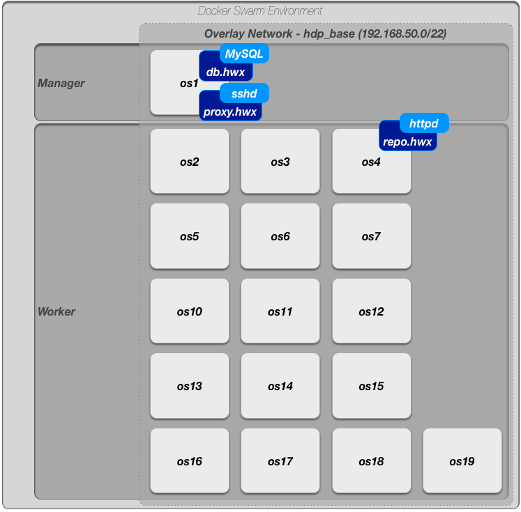

# ansible-playground

This project is a framework for building HDP/HDF clusters on bare metal hardware with Ansible and deployed across a Docker Swarm.

## Setting up the Docker Environment on Bare metal

### Bare Metal Steps (one time)
- Step 1:
  - Install [Docker and K8s on target hosts](./kubernetes/install_k8s.yaml)
- Step 2:
  - [Create Swarm Network for Docker](./infrastructure/docker-init-swarm.sh)

### Build out Docker Swarm


All hosts information and deployments are captured [here](./config/readme.markdown)

Docker Swarm and the base network is created [here](./infrastructure/docker-init-swarm.sh).  

Once the Swarm has been initialized, each host needs to [join it](./infrastructure/docker-join-swarm.sh).

After the Docker Swarm environment has been created, [assign docker node labels](./infrastructure/docker-node-labels.yaml) with this ansible playbook.

### Install Portainer for Docker Visibility

https://portainer.readthedocs.io/en/stable/


### Initialize the Infrastructure Containers

Every cluster has basic dependencies on infrastructure components like a 'database', a local 'repo' and 'ldap'.

With the 'hdp_base' network created with (./infrastructure/docker-init-swarm.sh) script, run the [infrastructure playbook](./hdp/setup/stack-compose/infra.yaml) to create the shared 'mysql' database, 'http repo' and 'proxy' host used by the clusters.

The 'proxy' host, which is an 'sshd' server with an exposed port, is attached to the docker network used by all the clusters.  I use this to 'tunnel' into the network via dynamic proxy, which I configure a browser to use.



### Creating a Cluster

In the [bin](bin) directory are helper scripts for creating hosts to deploy an HDP/HDF cluster on.  Each script requires a configuration parameter `-i <instance>`.  This reference a configuration file.  The 'instance' value is anything between 01 and 99.

Before running the [initialization script](./bin/01_deploy.py), create the supporting config file from either the [2.6 template](./config/template-2.6.yaml) or the [2.7 template](./config/template-2.7.yaml).  The configuration file identifies details about how to setup / start the desired cluster, starting with the location.

There are 4 location configurations (full, left, center, and right).  See [deployments](./config/readme.md) for details on these locations.

Each location template has been assigned to a particular set of hosts.  The hosts in the docker swarm cluster have been assigned 'node labels' to assist with placement.

The cluster deployments use 'docker stack deploy' via a docker compose file to publish hosts for the cluster.

The docker images have been configured to build on the hosts 'pam/sssd' integration with the FreeIPA server that's configured on OS1.  This is done by mounting the following on for images, see the [compose file](./hdp/setup/stack-compose/full.yaml):
```
- type: bind
  source: /var/lib/sss/pipes/
  target: /var/lib/sss/pipes/
- type: bind
  source: /var/lib/sss/mc/
  target: /var/lib/sss/mc/
```

#### Post Cluster Steps
If you are deploying the cluster without a blueprint, the `01_deploy.py` script will create the hosts, install and configure each host with Ambari and manually register those Ambari Agent hosts with the Ambari Server.

##### Next Steps
1. Create the Cluster via Ambari.
2. See the notes on [cluster configuration adjustments](./hdp_readme.md) to work in a docker stack environment.
3. Add support of ExtJs for Oozie Web UI.
  1. Run the [oozie extjs playbook](./hdp/setup/oozie-extjs.yaml) to add the libraries needed for the Oozie Web UI.
3. Restart the services.

##### Configure Best Practices

Depending on where you've install the Ranger Admin service, adjust your [docker hosts yaml file](./environment/hosts) for the cluster to include the references to the Ranger Admin UI.  Fix the following properties:
- zookeeper_server
- ranger_url_base

Then run the best practices scripts against the clusters.  This playbook can be found in the [hwx-sdlc-apps](https://github.com/dstreev/hwx-sdlc-apps) along with a [user onboarding](https://github.com/dstreev/hwx-sdlc-apps/blob/master/standards/02_onboard_user.yaml) helper script.

```
ansible-playbook -i <environment_host.yaml> standards/01_bp_ranger_policies.yaml
```

This will setup basic user and cluster rules for HDFS and Hive.

### Special Considerations

This is a docker environment, so we've needed to make a few adjustments to the HDP deployments to get them working.  See [HDP Readme](./hdp_readme.md) and [HDF Readme](./hdf_readme.md) for details.
